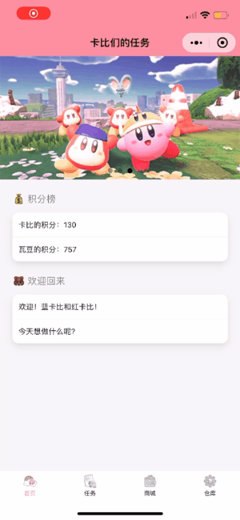
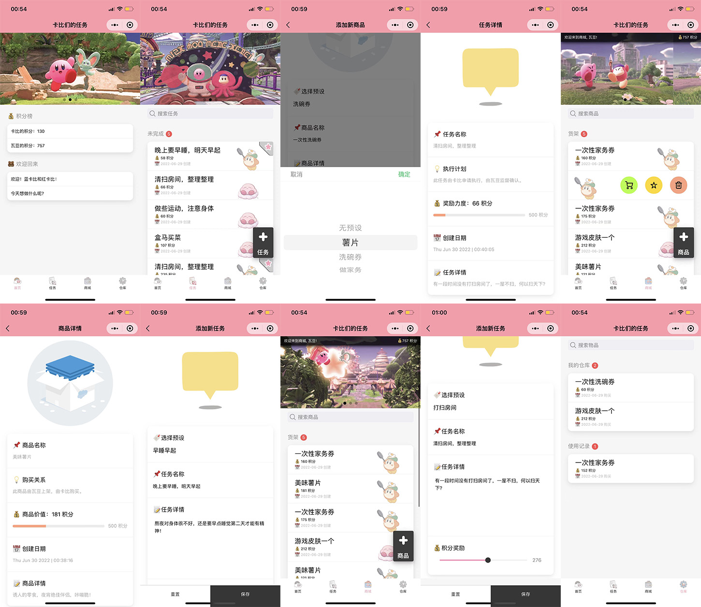
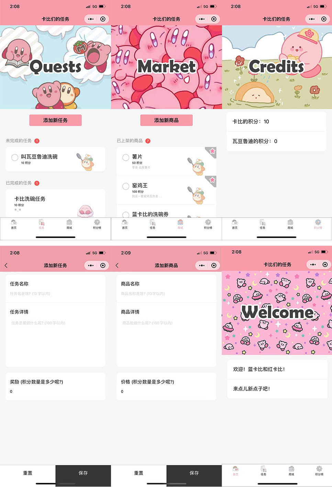

# 云开发双人互动小程序（做任务，攒积分，换商品）
## 序言
这是使用云开发能力构建的双人互动小程序，可以跟对象互动哦，其中使用了云开发基础能力的使用：
- **数据库**：对文档型数据库进行读写和管理
- **云函数**：在云端运行的代码，开发者只需编写业务逻辑代码
## 使用逻辑
打个比方:
- 女朋友发布任务->女朋友来做任务->做完后由你来确认完成->女朋友收到积分
- 你发布商品(洗碗券)->女朋友使用积分购买->商品进入到女朋友的库存->女朋友拿着洗碗券叫你洗碗->你洗碗->女朋友将物品(洗碗券)标记为已使用(不可逆)
- 这样做的原因是 不想给任何一方能自说自话 增加自己或者对方积分的能力[点击完成任务的人不能是获得积分的人也不能是自己]
## 版本新增
- 将所有非云函数的云逻辑**封装为云函数**
- 新增了**仓库系统**，购买了的商品会存入仓库，然后再被使用
- 新增了**搜索框**，可以搜索物品和任务
- 新增了**滑动窗**，可以自动播放显示多张图片
- 新增了**商品和任务预设**，添加商品或任务可以使用预设，非常迅速
- 将新增按钮变为可拖拽的**页面悬浮按钮**
- 购买，上架，新建任务的**时间都会被记录**并显示
- 取消了点击左边圆圈来完成或者购买，统一改为**左滑菜单**
- 左滑菜单统一用**图标**显示，更加精简
- 使用**特效升级**了详细信息页面与添加页面的美观度
- 添加任务或物品界面积分文本框改为**滑块**
- 在商城添加了**顶栏**显示积分，更直观
- 使用**表情符号**简单的增加了美感
## 效果图与动画
>
>
## 效果图
>

